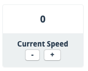

Version 2.3.0 of SWSheets was released on 02/09/2020.

This release included a few bug fixes as well as one enhancement which was to add increment and decrement buttons on vehicle speed.

Thanks [P47Thunderbolt](https://swsheets.com/u/P47Thunderbolt) for the suggestion as well as continued bug reports in the Fantasy Flight Games' forums [SWSheets thread](https://community.fantasyflightgames.com/topic/304147-swsheets-under-new-stewardship/)!

Be like [P47Thunderbolt](https://community.fantasyflightgames.com/profile/337897-p-47-thunderbolt/) and submit feature requests and bug reports!

You can read all of the release detail on [GitHub](https://github.com/swsheets/swsheets/releases/tag/v2.3.0).
