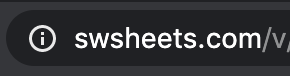
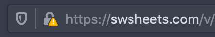

You may have noticed swsheets.com is now being served exclusively over HTTPS. Here's a quick explanation of what this means.

## tl;dr

You will soon only be allowed to use profile images that begin with `https://` for your characters and vehicles.

You are advised to update old characters and vehicle to use `https://` profile images, if they don't already.

## What is HTTPS?

> Hypertext transfer protocol secure (HTTPS) is the secure version of HTTP, which is the primary protocol used to send data between a web browser and a website. HTTPS is encrypted in order to increase security of data transfer. This is particularly important when users transmit sensitive data, such as by logging into a bank account, email service, or health insurance provider.
> <cite>[Cloudflare](https://www.cloudflare.com/learning/ssl/what-is-https/)</cite>

The bottom line is that HTTPS makes the web more secure. And while we're not protecting national secrets on SWSheets, it certainly doesn't hurt to be as safe and secure as we can.

## What does this mean for you?

It probably means nothing and will be transparent to you. However, there are a few things regarding character and vehicle profile images that you should know.

### Characters and vehicles created prior to January 21, 2020

- If your character or vehicle profile image URL begins with `https://`.

There's nothing to do.

- If your character or vehicle profile image URL begins with `http://`.

It will currently continue to work, however, you may see a notice from your browser that the site is serving [mixed content](https://developers.google.com/web/fundamentals/security/prevent-mixed-content/what-is-mixed-content). The browser is telling you that not _everything_ that the website is loading is being served over HTTPS - in this case, your profile image.

Browsers will _currently_ serve insecure images over HTTPS. SWSheets is not going to alter already created characters, but you are advised to update your profile images to HTTPS. In the future, browsers _may_ completely block mixed content images.

### Characters and vehicles created after January 21, 2020

You will only be allowed to add profile images for characters and vehicles that begin with `https://`. Profile images that begin with `http://` will not be allowed.
